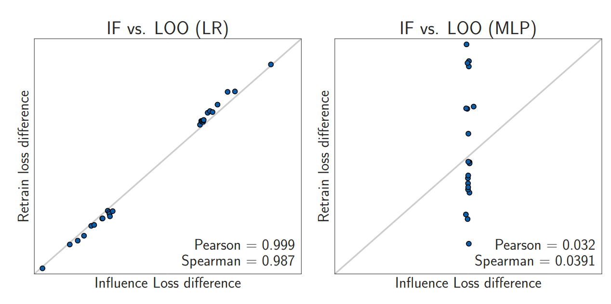
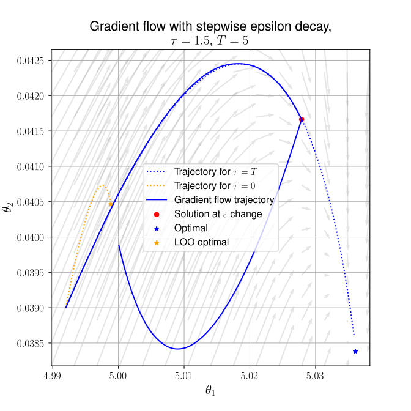
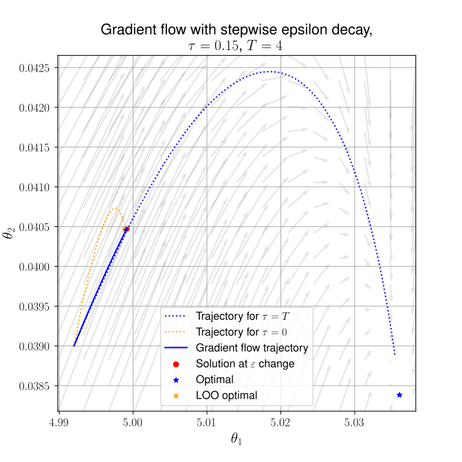

## Formation{transition="fade-in none-out"}
```{=html}
<div style="display:flex;gap:1rem;align-items:flex-start;flex-wrap:nowrap;">
  <iframe src="https://www.google.com/maps/embed?pb=!1m18!1m12!1m3!1d45211.603388780066!2d8.556058368287887!3d44.90858568307192!2m3!1f0!2f0!3f0!3m2!1i1024!2i768!4f13.1!3m3!1m2!1s0x47877431ed416505%3A0xd647f5990f0c62d9!2sAlessandria%2C%20Province%20of%20Alessandria%2C%20Italy!5e0!3m2!1sen!2sfr!4v1772632563726!5m2!1sen!2sfr" style="border:0;flex:0 0 48%;min-width:260px;height:360px;" allowfullscreen="" loading="lazy" referrerpolicy="no-referrer-when-downgrade"></iframe>
</div>
```
{.absolute top=77 left=520 height="360"}
<div style="text-align:center;">
  Born (2001)

  High school diploma in scientific subjects
</div>

## Formation {transition="none"}
```{=html}
<div style="display:flex;gap:1rem;align-items:flex-start;flex-wrap:nowrap;">
  <iframe src="https://www.google.com/maps/embed?pb=!1m18!1m12!1m3!1d45211.603388780066!2d8.556058368287887!3d44.90858568307192!2m3!1f0!2f0!3f0!3m2!1i1024!2i768!4f13.1!3m3!1m2!1s0x47877431ed416505%3A0xd647f5990f0c62d9!2sAlessandria%2C%20Province%20of%20Alessandria%2C%20Italy!5e0!3m2!1sen!2sfr!4v1772632563726!5m2!1sen!2sfr" style="border:0;flex:0 0 48%;min-width:260px;height:360px;" allowfullscreen="" loading="lazy" referrerpolicy="no-referrer-when-downgrade"></iframe>
</div>
```
{.absolute top=77 left=520 height="360"}
<div style="text-align:center;">
  University of Pisa

  Bachelor's and Master's degree in Mathematics
  
  (supervisor: Prof. Andrea Agazzi)
</div>


## Formation {transition="none"}
```{=html}
<div style="display:flex;gap:1rem;align-items:flex-start;flex-wrap:nowrap;">
  <iframe src="https://www.google.com/maps/embed?pb=!1m18!1m12!1m3!1d45211.603388780066!2d8.556058368287887!3d44.90858568307192!2m3!1f0!2f0!3f0!3m2!1i1024!2i768!4f13.1!3m3!1m2!1s0x47877431ed416505%3A0xd647f5990f0c62d9!2sAlessandria%2C%20Province%20of%20Alessandria%2C%20Italy!5e0!3m2!1sen!2sfr!4v1772632563726!5m2!1sen!2sfr" style="border:0;flex:0 0 48%;min-width:260px;height:360px;" allowfullscreen="" loading="lazy" referrerpolicy="no-referrer-when-downgrade"></iframe>
</div>
```
{.absolute top=77 left=520 height="360"}
<div style="text-align:center;">
  Hokkaido University 

  Master's degree in Mathematics 
  
  (supervisor: Prof. Yuzuru Sato)
</div>

## Influence Functions: Setting

Consider a generic machine learning framework:

- **training dataset**: $D = \{z_i=(x_i,y_i)\}_{i=1}^n \subset (\mathcal{X}\times\mathcal{Y})^n$ ;
- **model parameters**: $\theta \in \Theta \subseteq \mathbb{R}^d$ ;
- **model**: $f: \mathcal{X} \times \Theta \to \mathcal{Y}$ (e.g. a neural network) ;
- **loss function**: $\ell(z, \theta)$ (e.g. $\ell(z, \theta) = (f(x;\theta) - y)^2$ for regression) ;
- **empirical risk**: $L(\theta) = \frac{1}{n} \sum_{i=1}^n \ell(z_i, \theta)$ ;

## Influence Functions: Definition
<div style="height:30px;"></div>

::: {.centered-slide}
Define:
$$ 
\hat{\theta}(\varepsilon, j) = \arg\min_\theta \sum_{i\neq j}^n \ell(z_i, \theta) + \varepsilon \ell(z_j, \theta);
$$
I will denote $\hat{\theta}(1, j)= \hat{\theta}$ and $\hat{\theta}(0, j) = \hat{\theta}_{-j}$.

Given an index $j$, the influence function (IF) for the $j$-th training point is:
$$ \mathcal{I}(z_j) = \left.\frac{d}{d \,\varepsilon}{\hat{\theta}(\varepsilon, j)}\right|_{\varepsilon=0}.
$$
:::

## Influence Functions: Discussion
<div style="height:30px;"></div>

::: {.centered-slide}

:::{.frame}
**Interpretation:** $\mathcal{I}(z_j)$ measures the impact of $z_j$ on the position of the optimal parameter.
:::
If $\ell\in C^2$, we can compute $\mathcal{I}(z_j)$ using the formula:
$$ \mathcal{I}(z_j) = - H_{\hat{\theta}}^{-1} \nabla_\theta \ell(z_j, \hat{\theta})
$$ 
where $H_{\hat{\theta}}$ is the Hessian of $L$ at $\hat{\theta}$.

<span style="color:red;">**Drawback:**</span> Computing $H_{\hat{\theta}}^{-1}$ is very expensive.
:::

## Machine Unlearning
::: {.centered-slide}
Another use of IFs is to approximate the unlearning of the training point $z_j$.
In fact, by Taylor expansion, we have:
$$ \hat{\theta}(1, j) = \hat{\theta}(0, j) + \mathcal{I}(z_j) + O(\varepsilon^2) \implies \hat{\theta}_{-j} \approx \hat{\theta} - \mathcal{I}(z_j)
$$

::: {style="text-align: center;"}
<span style="font-size: 58px;">
**How good is this approximation?**
</span>

:::

:::

## Unlearning Approximation



::: {style="text-align: center;"}
# Is it really bad?
:::

## Definition of Unlearning
Maybe it's with PBRFs?

## Propositions

## Example: Linear Regression
::: {style="text-align: center;"}
{height=500}
{height=500}
:::

## Possible Applications to Plantnet

## Future Directions


