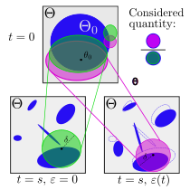
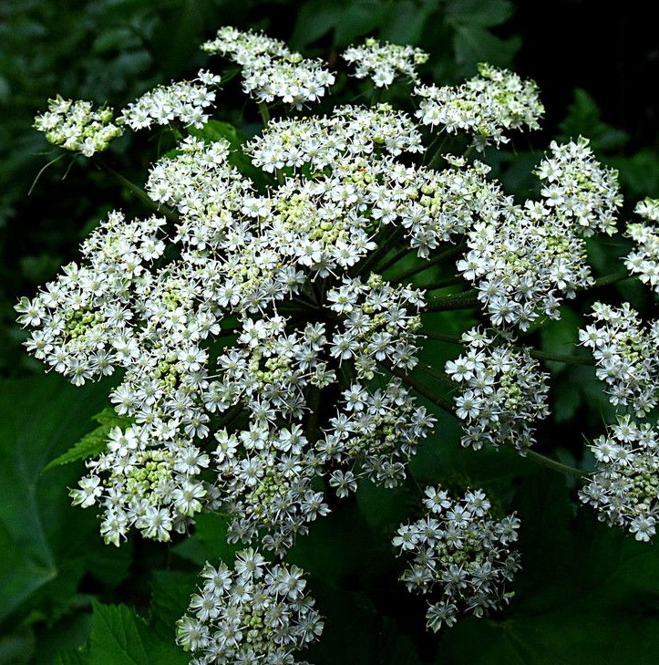
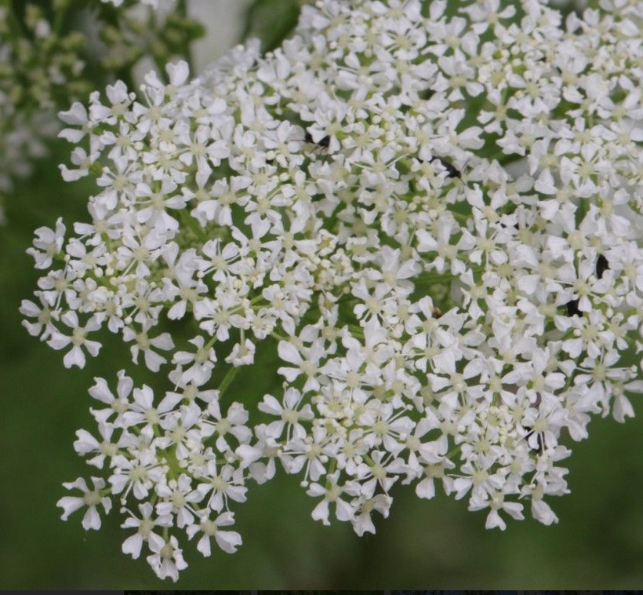
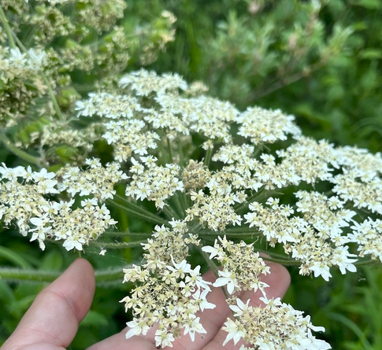
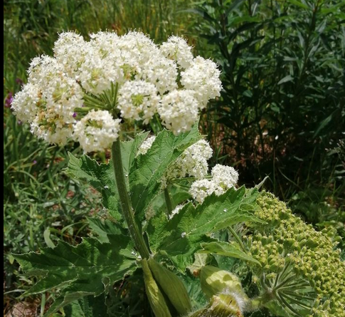
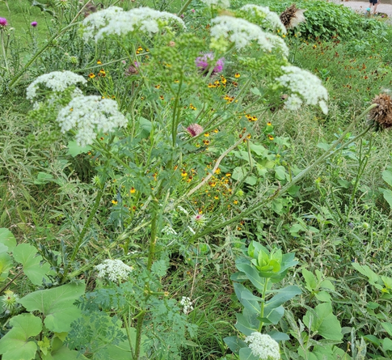
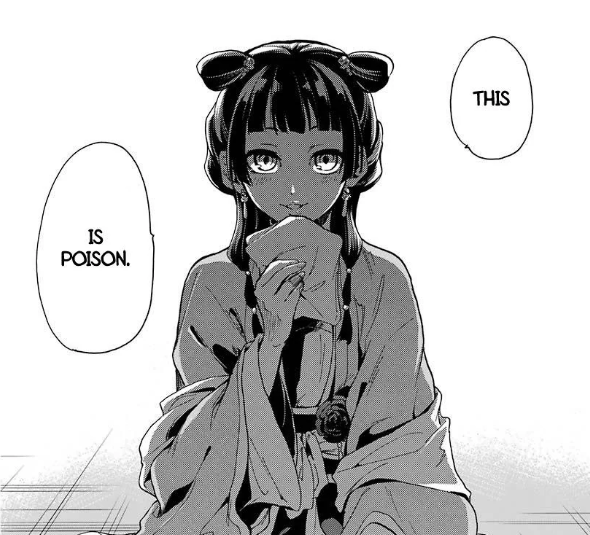

## Formation{transition="fade-in none-out"}
```{=html}
<div style="display:flex;gap:1rem;align-items:flex-start;flex-wrap:nowrap;">
  <iframe src="https://www.google.com/maps/embed?pb=!1m18!1m12!1m3!1d45211.603388834454!2d8.556058430255792!3d44.90858568300276!2m3!1f0!2f0!3f0!3m2!1i1024!2i768!4f13.1!3m3!1m2!1s0x47877431ed416505%3A0xd647f5990f0c62d9!2sAlessandria%2C%20Province%20of%20Alessandria%2C%20Italy!5e0!3m2!1sen!2sfr!4v1772793934286!5m2!1sen!2sfr" style="border:0;flex:0 0 48%;min-width:260px;height:360px;" allowfullscreen="" loading="lazy" referrerpolicy="no-referrer-when-downgrade"></iframe>
</div>
```
{.absolute top=77 left=520 height="360"}
<div style="text-align:center;">
  Born (2001)

  High school diploma in scientific subjects
</div>

## Formation {transition="none"}
```{=html}
<div style="display:flex;gap:1rem;align-items:flex-start;flex-wrap:nowrap;">
  <iframe src="https://www.google.com/maps/embed?pb=!1m18!1m12!1m3!1d46146.88221868415!2d10.354178717564546!3d43.70680534805318!2m3!1f0!2f0!3f0!3m2!1i1024!2i768!4f13.1!3m3!1m2!1s0x12d5919af0f6598f%3A0xaab80fb5a78478c8!2sPisa%2C%20Province%20of%20Pisa%2C%20Italy!5e0!3m2!1sen!2sfr!4v1772794044952!5m2!1sen!2sfr" style="border:0;flex:0 0 48%;min-width:260px;height:360px;" allowfullscreen="" loading="lazy" referrerpolicy="no-referrer-when-downgrade"></iframe>
</div>
```
{.absolute top=77 left=520 height="360"}
<div style="text-align:center;">
  University of Pisa

  Bachelor's and Master's degree in Mathematics
  
  (supervisor: Prof. Andrea Agazzi)
</div>


## Formation {transition="none"}
```{=html}
<div style="display:flex;gap:1rem;align-items:flex-start;flex-wrap:nowrap;">
  <iframe src="https://www.google.com/maps/embed?pb=!1m18!1m12!1m3!1d26072830.265485615!2d114.75178343859162!3d44.70981673947726!2m3!1f0!2f0!3f0!3m2!1i1024!2i768!4f13.1!3m3!1m2!1s0x5f0ad4755a973633%3A0x33937e9d4687bad5!2sSapporo%2C%20Hokkaido%2C%20Japan!5e0!3m2!1sen!2sfr!4v1772793807751!5m2!1sen!2sfr"  style="border:0;flex:0 0 48%;min-width:260px;height:360px;" allowfullscreen="" loading="lazy" referrerpolicy="no-referrer-when-downgrade"></iframe>
</div>
```
{.absolute top=77 left=520 height="360"}
<div style="text-align:center;">
  Hokkaido University 

  Master's degree in Mathematics 
  
  (supervisor: Prof. Yuzuru Sato)
</div>

## Formation {transition="none"}
```{=html}
<div style="display:flex;gap:1rem;align-items:flex-start;flex-wrap:nowrap;">
  <iframe src="https://www.google.com/maps/embed?pb=!1m18!1m12!1m3!1d46221.29399925721!2d3.8329700117539605!3d43.610062899166124!2m3!1f0!2f0!3f0!3m2!1i1024!2i768!4f13.1!3m3!1m2!1s0x12b6af0725dd9db1%3A0xad8756742894e802!2sMontpellier!5e0!3m2!1sen!2sfr!4v1772807465475!5m2!1sen!2sfr"  style="border:0;flex:0 0 48%;min-width:260px;height:360px;" allowfullscreen="" loading="lazy" referrerpolicy="no-referrer-when-downgrade"></iframe>
</div>
```
{.absolute top=77 left=520 height="360"}
<div style="text-align:center;">
  IROKO - IMAG

  PhD in Mathematics (Funding: ANR VITE)
  
  Supervisors: Joseph Salmon and Evgenii Chzhen
</div>

## Presentation Outline
::: {.centered-slide}

1. Introduction and use cases for **influence functions**.

<div style="height:20px;"></div>

2. Formal definition and discussion about **machine unlearning**.

<div style="height:20px;"></div>

3. Possible applications to Pl@ntNet.
:::

## Influence Functions: Setting

Consider a generic machine learning framework:

::: {.incremental}

- **training dataset**: $D = \{z_i=(x_i,y_i)\}_{i=1}^n \subset (\mathcal{X}\times\mathcal{Y})^n$ ;
- **model parameters**: $\theta \in \Theta \subseteq \mathbb{R}^d$ ;
- **model**: $f: \mathcal{X} \times \Theta \to \mathcal{Y}$ (e.g. a neural network) ;
- **loss function**: $\ell(z, \theta)$ (e.g. $\ell(z, \theta) = (f(x;\theta) - y)^2$ for regression) ;
- **empirical risk**: $L(\theta) = \frac{1}{n} \sum_{i=1}^n \ell(z_i, \theta)$ ;

:::

## Influence Functions: Definition
<div style="height:30px;"></div>

::: {.centered-slide}
Define:
$$ 
\hat{\theta}(\varepsilon, j) = \arg\min_\theta \sum_{i\neq j}^n \ell(z_i, \theta) + \varepsilon \ell(z_j, \theta);
$$
I will denote $\hat{\theta}(1, j)= \hat{\theta}$ and $\hat{\theta}(0, j) = \hat{\theta}_{-j}$.

Given an index $j$, the influence function for the $j$-th training point is:
$$ \mathcal{I}(z_j) = \left.\frac{d}{d \,\varepsilon}{\hat{\theta}(\varepsilon, j)}\right|_{\varepsilon=0}.
$$
:::

## Influence Functions: Discussion
<div style="height:30px;"></div>

::: {.centered-slide}

:::{.frame}
**Interpretation:** $\mathcal{I}(z_j)$ measures the impact of $z_j$ on the position of the optimal parameter.
:::
If $\ell\in C^2$, we can compute $\mathcal{I}(z_j)$ using the formula:
$$ \mathcal{I}(z_j) = - H_{\hat{\theta}}^{-1} \nabla_\theta \ell(z_j, \hat{\theta})
$$ 
where $H_{\hat{\theta}}$ is the Hessian of $L$ at $\hat{\theta}$.
:::

## Influence Functions: Discussion
::: {.centered-slide}
Influence Functions are vector-valued.

However, we can also compute them on metrics:

- **Utility:** $\sum_{z \in D} \nabla_\theta \ell(z, \hat{\theta})^\top H_{\hat{\theta}}^{-1} \nabla_\theta \ell(z_j, \hat{\theta})$;
- **Fairness:** $\nabla_\theta f_{\textrm{fair}}(D, \hat{\theta})^\top H_{\hat{\theta}}^{-1} \nabla_\theta \ell(z_j, \hat{\theta})$, with $f_{\textrm{fair}}$ a fairness metric (e.g., demographic parity);

<span style="color:red;">**Drawback:**</span> Computing $H_{\hat{\theta}}^{-1}$ is very expensive.

:::

## Machine Unlearning
::: {.centered-slide}
We want to remove the impact of $z_j$ from $\theta$ (neural network's parameter).

We can **unlearn** $z_j$ by Leave One Out (LOO) retraining, i.e. (fix a learning step $\eta>0$):

$$\begin{cases}
\theta(t) = \theta(t-1) -\frac{\eta}{n}\sum_{i\neq j}\nabla_\theta \ell(z_i,\theta(t-1)) \\
\theta(0)=\theta_0
\end{cases}$$
:::

## Unlearning by Influence Functions
::: {.centered-slide}
Influence functions approximate the unlearning of the training point $z_j$ **from the optimal parameter** $\hat \theta$.
By Taylor expansion, we have:
$$ \hat{\theta}(1, j) = \hat{\theta}(0, j) + \mathcal{I}(z_j) + O(\varepsilon^2) 
$$
$$\implies \hat{\theta}_{-j} \approx \hat{\theta} - \mathcal{I}(z_j)
$$

<!-- ::: {.fragment}
::: {style="text-align: center;"}
<span style="font-size: 58px;">
**How good is this approximation?**
</span> 

:::
::: -->
:::

## Unlearning Approximation{visibility="hidden"}


<span style="font-size: 21px;color:gray;">
["If Influence Functions are the Answer, Then What is the Question?",  J. Bae, N. Ng, A. Lo, M. Ghassemi, R. Grosse, 2022]
</span>

::: {style="text-align: center;"}
# Is it really bad?{visibility="hidden"}

<div style="height:30px;"></div>

:::{.fragment}
<span style="font-size: 61px;">
Depends on the definition!</span>

:::
:::

## Descend to Delete 
::: {style="text-align: center;"}
{height=500}
{height=500}
:::
<span style="font-size: 21px;color:gray;">
["Rewind-to-Delete: Certified Machine Unlearning for Nonconvex Functions", S. Mu, D. Klabjan, 2025]</span>

## Definition of Unlearning
<div style="height:20px;"></div>
What do we want to minimize?
<div style="height:20px;"></div> 

::: {.fragment}
Call $\theta(t)$ the flow of the LOO solution and $\tilde{\theta}(t)$ the flow of the unlearning procedure, both starting from $\theta_0\in\Theta$.

We can have 3 distances:

- $\frac12 \|\tilde{\theta}(T)-\hat\theta\|^2_\Theta$
- $\frac12 \|\tilde{\theta}(T)-\theta(T)\|^2_\Theta$
- $\frac12 \min_{t>0}\|\tilde{\theta}(T)-\theta(t)\|^2_\Theta$

:::


## Certified Removal{transition="slide-in none-out" transition-speed="default-in fast-out" visibility="hidden"}
::: {.centered-slide}
Consider a predictor $\mathcal{A}:(\mathcal{X}\times\mathcal{Y})^n\to\Theta$ and an unlearning procedure $\mathcal{M}(\mathcal{A}(D), D, j)\approx \hat{\theta}_{-j}$.

In the literature, they ask $\mathcal{M}$ to achieve **$\epsilon$-Certified Removal**, i.e., for all $S\in\mathcal{B}(\Theta)$, $j\in\{1,...,n\}$, and $D\in(\mathcal{X}\times\mathcal{Y})^n$:
$$ e^{-\epsilon} \leq \frac{P(\mathcal{M}(\mathcal{A}(D), D, j) \in S)}{P(\mathcal{A}(D\setminus\{z_j\}) \in S)} \leq e^{\epsilon}.
$$
<span style="font-size: 21px;color:gray;">
["Certified Data Removal from Machine Learning Models", Guo, C., Zhang, L., Vorobeychik, Y., & Li, B., 2020]</span>

:::

## Certified Removal{transition="fade" visibility="hidden"}
:::{.centered-slide}
:::{.frame}
**Idea:** We want the unlearning algorithm to be as close as possible to the LOO trajectory.
:::
**Note:** both algorithms $\mathcal{A}$ and $\mathcal{M}$ can be random!

Usually, to achieve $\epsilon$-CR gaussian noise is added.

$$ e^{-\epsilon} \leq \frac{P(\mathcal{M}(\mathcal{A}(D), D, j) \in S)}{P(\mathcal{A}(D\setminus\{z_j\}) \in S)} \leq e^{\epsilon}.
$$
:::

## Future Directions

- Unlearning via Fairness (assume data is distributed differently for each user $s\in S$, i.e., $(X_s,Y_s)\sim P_s$):
<span style="font-size: 32px;">
  $$ \mathbb{P}_X[f(X;\mathcal{M}(\mathcal{A},\mathcal{D},X_s))|X\notin X_s] = \mathbb{P}_X[f(X;\mathcal{M}(\mathcal{A},\mathcal{D},X_s))]. $$
</span>

- Distributional Unlearning:
<div style="display: flex; align-items: center; gap: 20px;">
  <div style="flex: 1; text-align: center; font-size: 35px;">
    $$
    \frac{\mathbb{P}_s[B_\delta(\tilde\theta(s))]}{\mathbb{P}_s[B_\delta(\theta(s))]} \ge 1-\alpha.
    $$
  </div>
  <div style="flex: 1; text-align: left;">
    
  </div>
</div>

# Possible Applications to Plantnet

## Better Image Proposals{transition="slide-in fade-out" transition-speed="default-in slow-out"}
<div style="display: flex; align-items: center; justify-content: space-between;">

  <div style="flex: 1; text-align: center;">

  

  </div>

  <div style="flex: 0 0 100px; text-align: center; margin-top: -50pt; margin-right: 50pt;">

  <div style="font-size: 2em;">
  
  $\xrightarrow{\text{Prediction}}$

  </div>

  </div>

  <div style="flex: 1;">

  <div style="margin-bottom: 10px;">

  

  </div>
  <div>

  
  
  </div>

  </div>

</div>

<span style="font-size: 21px;color:gray;">
[Pl@ntNet; pics by: Barbara MAI − Tela Botanica, Tuspring]
</span>

## Better Image Proposals{transition="fade-in slide-out" transition-speed="slow-in default-out"}
<div style="display: flex; align-items: center; justify-content: space-between;">

  <div style="flex: 1; text-align: center;">

  
  <figcaption style="text-align: center; font-size: 0.6em; margin-top: -15pt;">
    Common Cowparsnip
  </figcaption>

  </div>

  <div style="text-align: center; margin-top: -60pt; margin-right: 50pt;">

  <div style="font-size: 2em;">
  
  $\xrightarrow{\text{Prediction}}$

  </div>

  </div>

  <div style="flex: 1;">

  <div style="margin-bottom: 10px;">

  
  <figcaption style="text-align: left; font-size: 0.6em; color: #af1818ff; margin-top: -15pt;">
    Poison Hemlock
  </figcaption>

  </div>
  <div>

  
  <figcaption style="text-align: left; font-size: 0.6em; color: green;
  margin-top: -15pt;">
    Common Cowparsnip
  </figcaption>
  
  </div>

  </div>

</div>
<span style="font-size: 21px;color:gray;">
[Pl@ntNet; pics by: Philippe CATHERINE, Andrea Ang101]
</span>


## Data Poisoning
<div style="height:60px;"></div>
<div style="display: flex; align-items: center; justify-content: space-between;">

  <div style="flex: 1; text-align: center;">

  
  <figcaption style="text-align: center; font-size: 0.6em; margin-top: -15pt; color: #af1818ff;">
    Common Cowparsnip 

  <span style="font-size: 21px;color:green; text-decoration: line-through;">
    Poison Hemlock
  </span>

  </figcaption>

  </div>

  <div style="text-align: center; margin-top: -60pt; margin-right: 50pt;">

  <div style="font-size: 2em;">
  
  $\xrightarrow{\text{Bad Prediction}}$

  </div>

  </div>

  <div style="flex: 1;margin-top: -50pt;">

  

  <figcaption style="text-align: left; font-size: 0.6em; color: green;
  margin-top: -15pt; margin-left: -10pt;">
    Common Cowparsnip
  </figcaption>

  </div>

</div>

<div style="text-align: center;margin-top: -15pt;">

</div>


## Summary
::: {.centered-slide}
My research aims to:

- Apply influence functions to machine unlearning and data poisoning;

- Explore different theoretical frameworks for generic unlearning;

<div style="height:20px;"></div> 
<span style="font-size: 21px;color:gray;">
["If Influence Functions are the Answer, Then What is the Question?",  J. Bae, N. Ng, A. Lo, M. Ghassemi, R. Grosse, 2022]</br>
["Certified Data Removal from Machine Learning Models", Guo, C., Zhang, L., Vorobeychik, Y., & Li, B., 2020]</br>
["Rewind-to-Delete: Certified Machine Unlearning for Nonconvex Functions", S. Mu, D. Klabjan, 2025]
</span>

:::

::: {style="text-align: center;"}
# Thank you for the warm welcome!!
:::